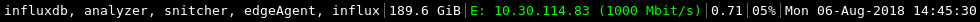

# i3status-run

Run arbitrary commands to integrate with i3status

## Build

Install Rust with [rustup](https://rustup.rs/). Then clone this repo and run:

```
cargo install
```

## Usage

If you wanted to show the names of all docker containers running on your PC for
example, create a file such as the following (say, in `~/bin/my_i3status.sh`):

```bash
#!/bin/bash

i3status | i3status-run bash -c 'echo "{\"full_text\": \"$(docker ps -a --format "{{.Names}}" | paste -s -d "," - | sed "s/,/, /g")\", \"markup\": \"none\", \"name\": \"containers\"}"'
```

And change your `bar` configuration in i3 to look something like this:

```
bar {
    status_command ~/bin/my_i3status.sh
    font pango:monospace 10
}
```

And you should get something that looks like this:


